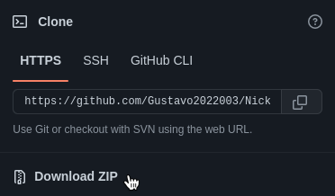
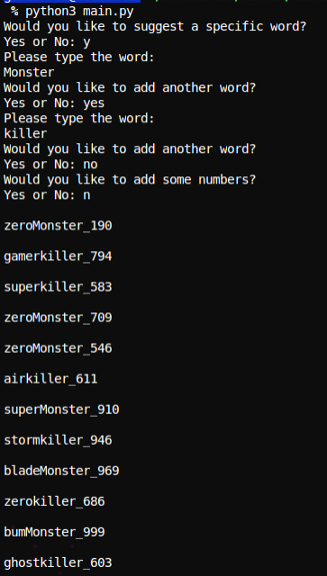
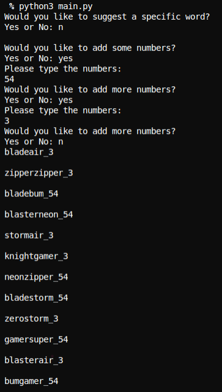

<p>
 
 
</p>
 A program that can generate a new nickname for you!
 
 ## Before you continue...
 - If you are having any issue trying to run this program, please read the entire README.md, and if you are still getting difficulties to run, <a href="https://github.com/Syntax-Developers">contact us</a>.
 - Please if you have any idea, feedback, bug report or want to join the collaborators, subscribe into our <a href="https://github.com/Gustavo2022003/Nickname-generator/discussions">Dicussions</a> page or contact the administrators!
 - The administrators regularly are in the <a href="https://github.com/Gustavo2022003/Nickname-generator/discussions">Dicussions</a> page.
 - Admins take 24-48h to answer any question found on the <a href="https://github.com/Gustavo2022003/Nickname-generator/discussions">Dicussions</a> page. If you do not receive a response in time, please contact us through our organization: <a href="https://github.com/Syntax-Developers">here</a>.
 - Please, if you have something urgent to talk to us, visit our <a href="https://github.com/Syntax-Developers">Organization page</a> and contact us.
 - If you want to donate to this project, please <a href="https://github.com/Syntax-Developers">contact us</a>.
 - Your feedback is important to us!
 
 
 ## Summary
 - [Installation](#installation)
 - [Technologies](#technologies)
 - [Compatible operating systems](#compatible-operating-systems)
 - [Running the program](#running-the-program)
 - [How it works?](#how-it-works)
 - [Examples](#examples)
 - [Creators](#creators)
 - [License](#license)
 - [Specific Project Details](#specific-project-details)
 
 ## Installation
 ```git-clone https://github.com/Gustavo2022003/Nickname-generator.git```
 
 Or you can install it by clicking here:
<p>
  
</p>
 
## technologies
### We recommend Python 3.10.4 or above to run this program, otherwise you can have some issues!
<p>
  
</p>

## Compatible operating systems
<p>
 
 
 
</p>

----

## Running the program
1) Open the ```.../Nickname-generator``` folder in your terminal
2) Type: 
```
python3 main.py
```
## How it works?

When you execute the program, it will show this message: "Would you like to suggest a specific word?"
it means that you can choose one or more words to add into your nickname. You can refuse it.

Then after the program ask you if you want to add some words or not in the nickname, it will ask if you want to suggest any number
to put in too ("would you like to add some numbers?")

After those two steps the program will generate some nicknames based in what you preferences.

### Examples:

<p>
  <p>Example 1</p>
  
  <p>Example 2</p>
  
</p>

# Creators
<p>
 <a src="https://github.com/Gustavo2022003"></a>
 <a src="https://github.com/GustavoGTRZ"></a>
</p>

## License

<a target="_blank" href="https://choosealicense.com/licenses/mit/">MIT</a>

## Specific Project Details

- Specification of the system from which the program was made:

> Operatioal System: Linux Ubuntu 22.04 LTS

> RAM: 16 GB DDR4

> Processor: Intel Core i5-10400F

> Processor Cores: 6

> Threads: 12

> Python Version: 3.10.4


